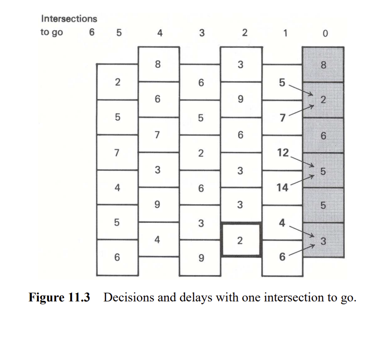

Neste exemplo sçao casa ligadas umas as outras exemplificando como um pessoa pode chegar de um ponto da cidadea outro em quanto tempo. 

Dynamic programming reduces the number of computations by moving systematically from one side to the other, building the best solution as it goes.

Suppose that we move backward through the diagram from right to left. If we are in any intersection (box)
with no further intersections to go, we have no decision to make and simply incur the delay corresponding to
that intersection. The last column in Fig. 11.2 summarizes the delays with no (zero) intersections to go.

Nossa primeira decisão (da direita para a esquerda) ocorre com uma etapa, ou interseção, restante. Se por exemplo, nós
estão na intersecção correspondente à caixa destacada na Fig. 11.2, incorremos em um atraso de três minutos em
neste cruzamento e um atraso de oito ou dois minutos no último cruzamento, dependendo se
subimos ou descemos. Portanto, o menor atraso possível, ou solução ótima, nesta intersecção é
3+2 = 5 minutos. Da mesma forma, podemos considerar cada intersecção (caixa) nesta coluna por vez e calcular o
menor atraso total como resultado de estar em cada interseção. A solução é dada pelos números em negrito
na Figura 11.3. As setas indicam a decisão ótima, para cima ou para baixo, em qualquer intersecção com um estágio, ou um
cruzamento, para ir.

